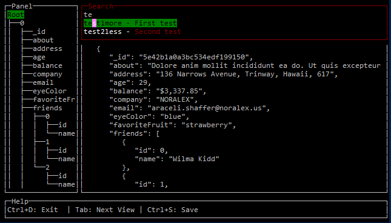

# kube-review

kube-review is an ncurses (terminal GUI) based tool for reviewing the configuration of a kubernetes cluster. Below is an example of the user interface:

## Eventual Features
* Interactive search in GUI 
  * regex search by default 
  * Can also use bunch of pre-writen regexes for known issues
  * Can add additional to pre-written
  * Introduce a ctrl-s to save output
    * If in query mode, offer ability to save as vulnXML
* Loading of JSON
  * This can be done by loading offline file
  * Or if you have a kubeconfig, it will use that to pull the needed config from cluster
* Search
  * regex based search
  * query based search
  * intelligent search 
    * allow user to define fields around match to retain e.g. names/ids
    * need to figure out an intelligent cut off (potentially when exiting an array)
  * User will be able to find or filter with the search
* Query without GUI
  * define which queries to run
  * option for just passing a regex
  * option for intelligent search
* Save
  * Basic just output JSON of search
  * Create VulnXML issues (would have to be with queries)
  * Save config gained from kubectl command

## TODO
* Intelligent search
* Interactive save
* Create a predefined querylist
* kubectl pull of config
* Create and save query
* query without GUI
* Save vulnXML